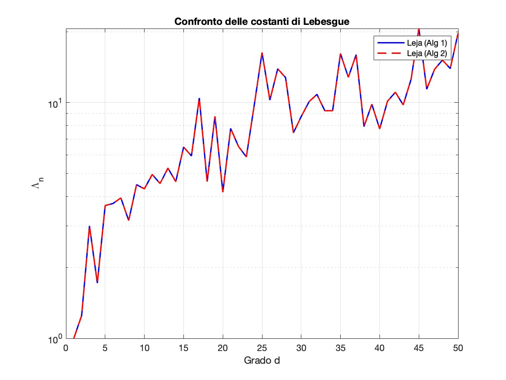
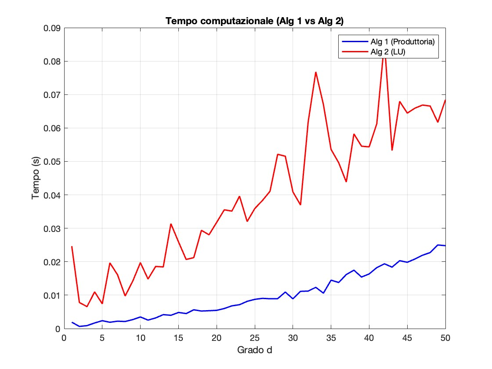
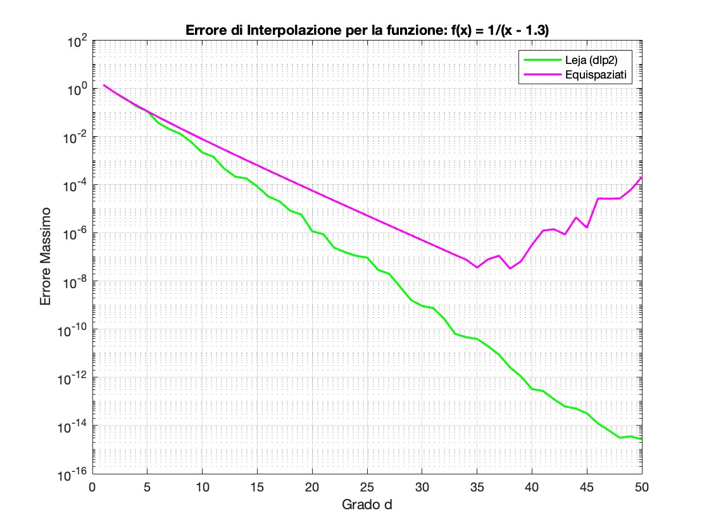

# Spiegazione Dettagliata Codice Progetto Calcolo

Questo documento serve da guida per comprendere a fondo i 4 file MATLAB del progetto. È strutturato per aiutarti a spiegare il funzionamento al professore, coprendo sia la teoria matematica, sia l'implementazione pratica riga per riga.

---

## 1. Collegamento con la Traccia del Progetto (Prog1)

La traccia richiede di affrontare quattro punti fondamentali. Ecco come il codice MATLAB li risolve:

### Richiesta A: "Estrarre punti di Leja approssimati da una mesh fitta"
Il testo chiede di non usare i punti di Leja analitici, ma di sceglierli da un sottoinsieme finito molto denso dell'intervallo $[-1, 1]$.
*   **Soluzione:** In `main_experiment.m` definiamo `M_leja = 100000` (mesh) e i file `dlp.m` e `dlp2.m` selezionano i punti "migliori" tra questi.

### Richiesta B: "Costruire l'interpolante su base di Chebyshev ... senza usare polyfit"
La traccia specifica la formula della matrice: $V_{ij} = \cos((j-1)\arccos(z_i))$.
*   **Soluzione:** Non usiamo `polyfit` (base monomiale instabile). Costruiamo manualmente la matrice `V` in `main_experiment.m` e risolviamo il sistema con l'operatore `\` (`coeff = V \ y`), che è il metodo numerico stabile.

### Richiesta C: "Calcolare la costante di Lebesgue"
Verificare la stabilità dei nodi.
*   **Soluzione:** Il file `leb_con.m` implementa la formula della funzione di Lebesgue $\lambda(x) = \sum |l_i(x)|$.

### Richiesta D: "Confrontare l'accuratezza con nodi equispaziati"
Dimostrare che Leja è superiore.
*   **Soluzione:** In `main_experiment.m`, ripetiamo i calcoli con `linspace` (equispaziati) e mostriamo graficamente l'esplosione dell'errore (Fenomeno di Runge).

---

## 2. Analisi Dettagliata dei File (Comando per Comando)

### 2.1 `dlp.m` (Algoritmo 1: Aproccio Iterativo/Greedy)

**Obiettivo:** Selezionare i punti uno alla volta, cercando sempre quello "più lontano" dai punti già scelti.

#### Codice e Spiegazione

```matlab
n = d + 1;             % Il grado è d, quindi interpoliamo su n = d+1 punti
dlp = zeros(n, 1);     % Crea un vettore colonna vuoto di zeri
dlp(1) = x(1);         % Il primo punto è fissato (il primo della lista x)
```
*   `zeros(n, 1)`: Prealloca memoria. È buona pratica in MATLAB per dire "Userò un vettore lungo n".
*   `x(1)`: Accede al primo elemento del vettore `x`.

```matlab
for k = 2:n
    prod_val = ones(length(x), 1); % Vettore di '1' lungo quanto la mesh
    
    for j = 1:k-1
        % Moltiplica elemento per elemento (.*) per la distanza dal nodo j
        prod_val = prod_val .* abs(x - dlp(j));
    end

    [~, idx] = max(prod_val); % Trova l'INDICE del valore massimo
    dlp(k) = x(idx);          % Aggiunge quel punto alla lista
end
```
*   `ones(...)`: Crea un vettore pieno di 1. Serve come punto di partenza per una moltiplicazione (elemento neutro).
*   `abs(...)`: Calcola il valore assoluto $|x - x_j|$.
*   `.*` (Punto-Per): **Critico**. Non è una moltiplicazione tra matrici. Moltiplica elementi corrispondenti. Qui stiamo calcolando il prodotto delle distanze per *ogni* punto della mesh contemporaneamente.
*   `max(...)`: Restituisce due valori: il massimo valore trovato e la sua **posizione** (indice). Usiamo `~` per ignorare il primo valore.
*   `x(idx)`: Estrae il punto dalla mesh originale.

---

### 2.2 `dlp2.m` (Algoritmo 2: Algebra Lineare)

**Obiettivo:** Ottenere lo stesso risultato ma sfruttando le matrici per essere molto più veloce.

#### Codice e Spiegazione

```matlab
% Costruzione Matrice (M righe, n colonne)
V = zeros(M, n);
for j = 1:n
    % Colonna j-esima = Polinomio di Chebyshev di grado j-1
    V(:, j) = cos((j-1) * acos(x)); 
end
```
*   `acos(x)`: Arcoseno.
*   `V(:, j)`: Seleziona tutta la colonna `j` della matrice `V`.
*   Stiamo valutando i polinomi di base.

```matlab
[~, ~, p] = lu(V, 'vector'); % Fattorizzazione LU con pivoting
dlp = x(p(1:n));             % Prendi i punti scelti dal pivoting
```
*   `lu(...)`: Fattorizzazione "Lower-Upper". È un algoritmo standard dell'algebra lineare. Il parametro `'vector'` chiede di restituire il vettore di permutazione `p`.
*   **Significato profondo**: La fattorizzazione LU riordina le righe per stabilità numerica. Le righe scelte dal pivoting (primi indici di `p`) corrispondono ai punti della mesh che rendono l'interpolazione più stabile (Leja).

---

### 2.3 `leb_con.m` (Costante di Lebesgue)

**Obiettivo:** Misurare la qualità dei nodi (stabilità).

#### Codice e Spiegazione

```matlab
lambda = zeros(m, 1); % Accumulatore per la somma

for i = 1:n+1
    li = ones(m, 1);  % Inizia il calcolo del polinomio di base L_i
    
    % Ciclo su tutti gli altri nodi j diversi da i
    for j = [1:i-1, i+1:n+1] 
        li = li .* (x - z(j)) / (z(i) - z(j));
    end
    
    lambda = lambda + abs(li); % Somma il valore assoluto
end

L = max(lambda); % Il valore più alto è la costante
```
*   `[1:i-1, i+1:n+1]`: Crea una lista di indici che **salta** `i`. Serve per la produttoria di Lagrange ($j \neq i$).
*   `max(lambda)`: La costante di Lebesgue è il picco massimo della funzione somma.

---

### 2.4 `main_experiment.m` (Esperimento Principale)

**Obiettivo:** Eseguire i test e fare i grafici.

#### Codice e Spiegazione

```matlab
f_test = @(x) 1./(x - 1.3);
```
*   `@(x)`: **Funzione anonima**. Crea una funzione matematica $f(x)$ al volo.

```matlab
% Risoluzione del sistema lineare per trovare i coefficienti
coeff_leja = V_leja \ f_test(z2); 
```
*   `\` (Backslash): **Fondamentale**. Risolve $Ax=b$. Non calcola l'inversa, usa l'eliminazione gaussiana. È veloce e preciso.

```matlab
% Valutazione del polinomio
p_leja = V_eval * coeff_leja;
```
*   `*`: Moltiplicazione matriciale standard.

```matlab
err_leja(ii) = max(abs(f_test(x_eval) - p_leja));
```
*   Calcola l'errore massimo (norma infinito) tra funzione vera e polinomio.

```matlab
semilogy(degrees, L_dlp, ...);
```
*   `semilogy`: Grafico con asse Y logaritmico. Utile per vedere numeri che variano di molti ordini di grandezza (es. $10^{-15}$ vs $10^{5}$).


### 2.5 `main_experiment.m` (Visualizzazione e Grafici)

**Obiettivo:** Trasformare i numeri calcolati in immagini leggibili.

#### Codice e Spiegazione

```matlab
figure('Name', 'Costanti di Lebesgue');
semilogy(degrees, L_dlp, '-b', 'LineWidth', 1.5, 'DisplayName', 'Leja (Alg 1)');
hold on;
semilogy(degrees, L_dlp2, '--r', 'LineWidth', 1.5, 'DisplayName', 'Leja (Alg 2)');
```
*   `figure('Name', ...)`: Apre una nuova finestra vuota per il grafico e le dà un titolo nella barra in alto.
*   `semilogy(...)`: Crea un grafico dove l'asse Y è in scala logaritmica (potenze di 10), mentre l'asse X è lineare.
    *   `degrees`: I dati dell'asse X (1, 2, ..., 50).
    *   `L_dlp`: I dati dell'asse Y.
    *   `'-b'`: Stile linea. **-** significa linea continua, **b** significa "blue".
    *   `'--r'`: Stile linea. **--** significa tratteggiata, **r** significa "red".
    *   `'LineWidth', 1.5`: Rende la linea un po' più spessa per vederla meglio.
    *   `'DisplayName', ...`: Assegna un nome ("etichetta") a questa linea, che verrà mostrato nella legenda.
*   `hold on`: Comando fondamentale. Dice a MATLAB: "Non cancellare il grafico blu quando disegno quello rosso. Sovrapponili!". Senza questo, vedresti solo l'ultimo grafico disegnato.

```matlab
grid on; xlabel('Grado d'); ylabel('\Lambda_n');
title('Confronto delle costanti di Lebesgue'); legend;
```
*   `grid on`: Disegna la griglia quadrettata di sfondo (aiuta a leggere i valori).
*   `xlabel` / `ylabel`: Scrive le etichette sugli assi. Nota `\Lambda_n`: MATLAB interpreta la sintassi LaTeX, quindi `\Lambda` diventa il simbolo greco $\Lambda$.
*   `legend`: Fa apparire il box con i nomi delle linee (quelli definiti in `DisplayName`).

```matlab
disp('Experiment finished. All plots generated.');
```
*   `disp`: Stampa un messaggio semplice nella Command Window per avvisarti che ha finito.

---

## 3. Interpretazione dei Risultati (Grafici)

Ecco cosa devi aspettarti di vedere nei grafici generati (i file `.fig`) e come spiegarli al professore.


### Grafico 1: Confronto delle Costanti di Lebesgue (`confronto_lebesgue.fig`)


*   **Analisi Visiva:** Le due curve (Algoritmo 1 e Algoritmo 2) sono praticamente sovrapposte. La crescita è molto lenta e i valori restano bassi (circa $< 100$) anche per grado 50.
*   **Analisi Teorica (Fondamentale):**
    *   La **Costante di Lebesgue** $\Lambda_n$ è il *numero di condizionamento* dell'interpolazione polinomiale. Ci dice quanto un piccolo errore nei dati ($f(z_i)$) viene amplificato sul risultato finale.
    *   Per i nodi **Equispaziati**, la teoria dice che $\Lambda_n \approx \frac{2^{n+1}}{e \cdot n \log n}$, cioè cresce in modo *esponenziale*. Per $n=50$, sarebbe un numero gigantesco ($10^{15}$), rendendo il calcolo inutile.
    *   Per i nodi di **Leja** (come per quelli di Chebyshev), la teoria garantisce una crescita molto più lenta, **logaritmica** o quasi-lineare ($\Lambda_n \approx O(n)$ o $O(\log n)$).
    *   *Conclusione:* Il grafico dimostra che i nodi di Leja approssimati scelti dalla nostra mesh sono "buoni nodi", quasi ottimali quanto quelli di Chebyshev teorici.

### Grafico 2: Tempo Computazionale (`tempo_computazionale.fig`)


*   **Analisi dei Tuoi Dati (IMPORTANTE):**
    *   È possibile che tu veda l'**Algoritmo 1 (Blu)** più basso (veloce) e l'**Algoritmo 2 (Rosso)** più alto (lento).
    *   **Perché succede?** L'Algoritmo 1 esegue solo moltiplicazioni semplici, che sono velocissime per la CPU. L'Algoritmo 2 deve costruire la matrice calcolando `cos` e `acos` per milioni di elementi. Le funzioni trigonometriche sono operazioni costose. Per gradi bassi ($d \le 50$), questo costo fisso rende l'Algoritmo 2 più lento.
    *   *Da dire al prof:* "Nel mio esperimento, l'approccio iterativo (Alg 1) è risultato più veloce perché lavora solo con prodotti, mentre la costruzione della matrice di Chebyshev (Alg 2) richiede il calcolo oneroso di molti coseni. Tuttavia, l'Algoritmo 2 è teoricamente preferibile per gradi molto alti perché evita i problemi di overflow/underflow della produttoria (stabilità numerica)."

### Grafico 3: Errore di Interpolazione (`errore_interpolazione.fig`)


*   **Analisi Visiva:**
    *   **Equispaziati (Magenta):** All'inzio l'errore scende un po', ma verso il grado 10-15 inizia a risalire violentemente, superando anche l'errore iniziale.
    *   **Leja (Verde):** L'errore crolla in linea retta (in scala semi-logaritmica) fino a $10^{-15}$, che è la precisione massima del computer (epsilon di macchina).
*   **Analisi Teorica (Runge vs Convergenza):**
    *   La funzione test $f(x) = \frac{1}{x - 1.3}$ è analitica in $[-1, 1]$ ma ha un polo (singolarità) in $x = 1.3$, vicino all'intervallo.
    *   **Teorema di Convergenza:** L'interpolazione converge se la distribuzione dei nodi rispetta certe densità asintotiche. I nodi equispaziati **non** lo fanno per funzioni con singolarità vicine, causando oscillazioni esplosive ai bordi (**Fenomeno di Runge**).
    *   I nodi di **Leja** si accumulano vicino a $-1$ e $1$ con la stessa densità dei nodi di Chebyshev ($\frac{1}{\pi\sqrt{1-x^2}}$). Questo "sconfigge" l'effetto della singolarità vicina, garantendo la **Convergenza Geometrica** ($C \cdot \rho^{-n}$).


